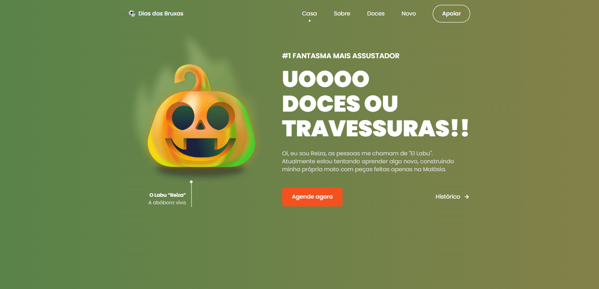

# Site Responsivo de Halloween 🎃

### Site Responsivo de Halloween 🎃

- Site responsivo de Halloween usando HTML, CSS e JavaScript.
- Contém animações ao rolar.
- Possui três designs de cores (verde, vermelho e preto)
- Rolagem suave em cada seção.
- Desenvolvido primeiro com a metodologia Mobile First, depois para desktop.
- Compatível com todos os dispositivos móveis e com uma interface de usuário bonita e agradável.

### Tecnologias que foram utilizada

 

 

## [Video do projeto](https://youtu.be/lgo1CEPZoxg)

<h4 align="center">
    Feito com 🖤 by <a href="https://www.linkedin.com/in/lcamargodasilva/" target="_blank">Lucas Camargo</a>
</h4>
